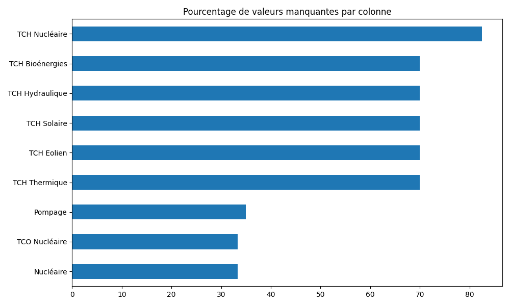
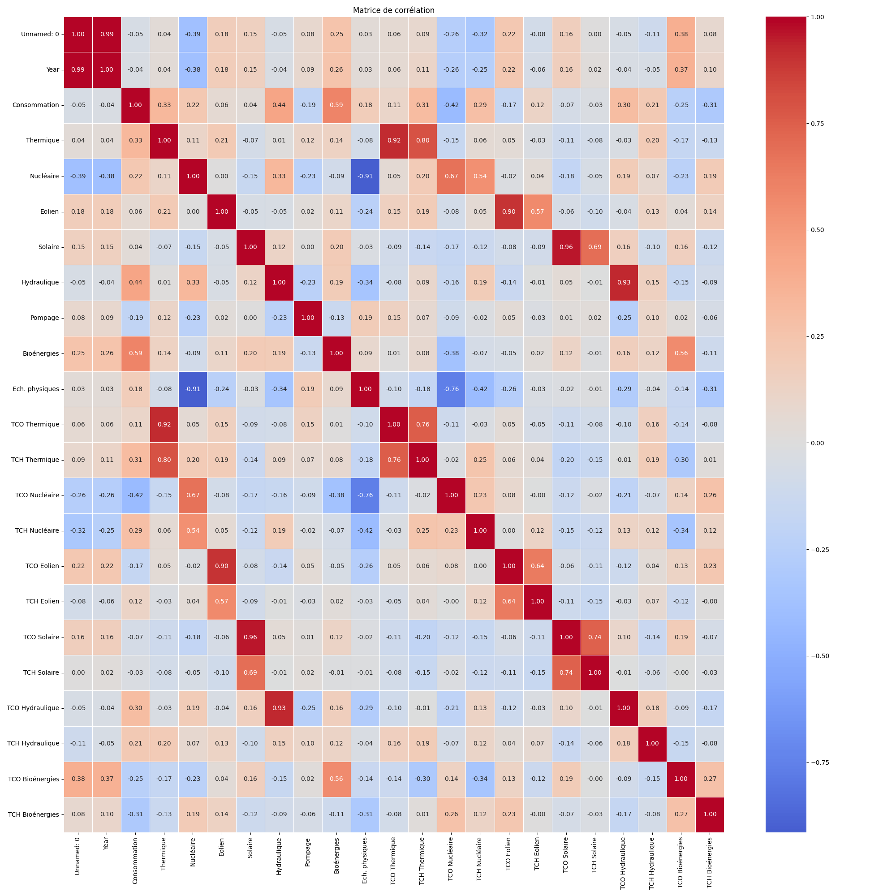
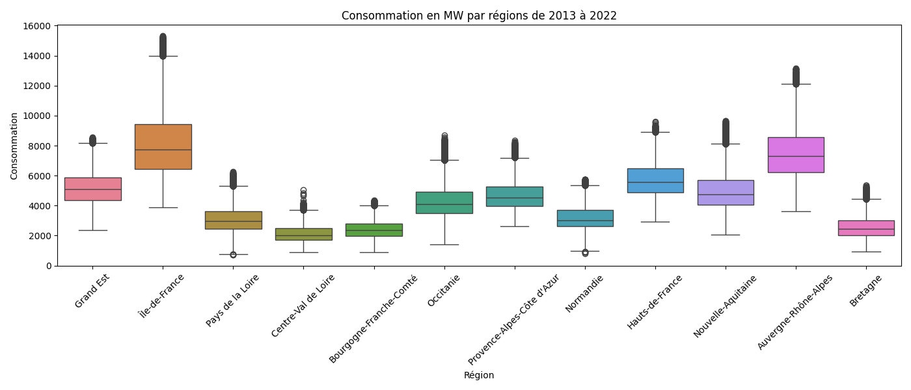
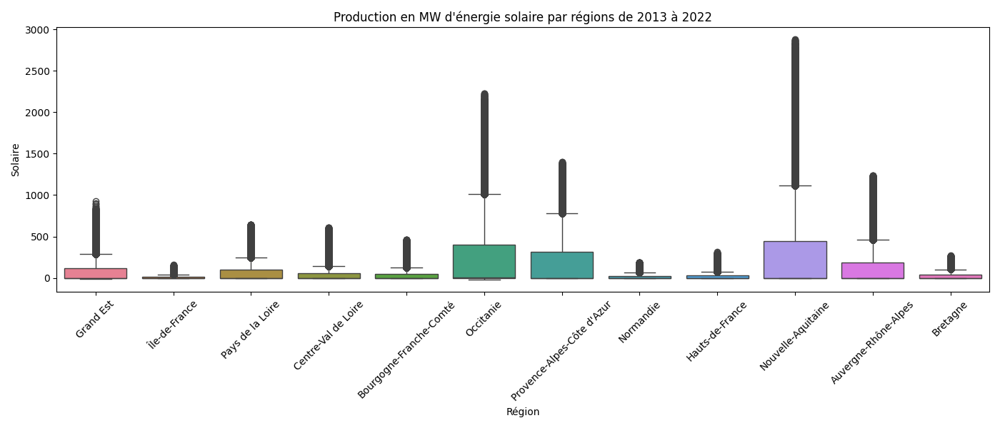
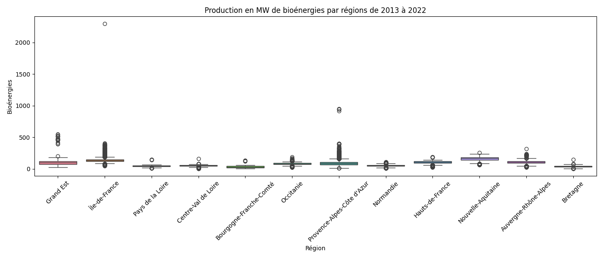

# Projet Énergie - Analyse et Visualisation

Ce projet présente une **analyse exploratoire et visualisation des données de production et consommation d'énergie en France** de 2013 à 2022.  
Il comprend :  

- Un notebook Python pour le **nettoyage et l'analyse des données** (`Code Nettoyage.ipynb`)  
- Un script Python pour **générer automatiquement les graphs** (`generate_graphs.py`)  
- Des images des résultats Python (`images/*.png`)  
- Des exports de rapports Power BI (`GraphsPBI/*.jpg`)  

---

## Graphs Python (aperçu)

Ces graphs ont été générés automatiquement à partir du fichier nettoyé.

  
  
  
  
  

---

## Graphs Power BI (aperçu)

Ci-dessous, les 3 premiers graphs exportés depuis Power BI.  
Les autres exports sont disponibles dans le dossier [`GraphsPBI`](GraphsPBI).

  
  
  

---

## Objectifs

- Analyser la consommation et la production énergétique régionale en France.
- Croiser les données de consommation avec la population pour identifier des tendances.
- Détecter une dépendance de la France à l'énergie nucléaire. 
- Analyser l'évolution des énergies renouvelables.
- Visualiser les résultats via Power BI.

---

## Remarques

- Les fichiers CSV et le fichier `.pbix` **ne sont pas publiés** pour alléger le dépôt.  
- Les graphs Python sont générés à partir du fichier nettoyé (`nrj_nettoye_vf.csv`), disponible localement.  
- Les exports Power BI présents dans `GraphsPBI` permettent de visualiser le tableau de bord complet.

---

*Projet réalisé par Paul S, Sébastien B, Julien M et Cécile E*